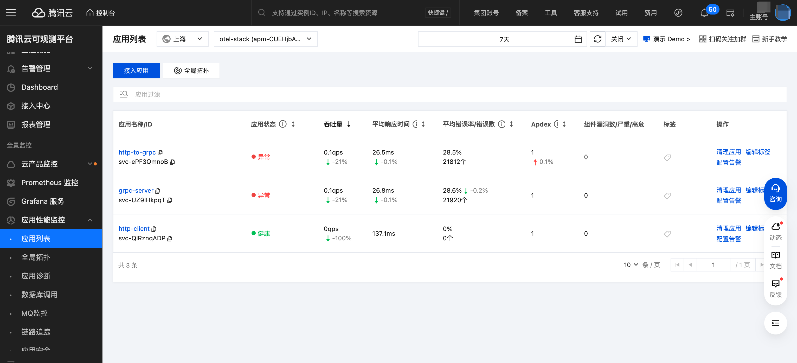
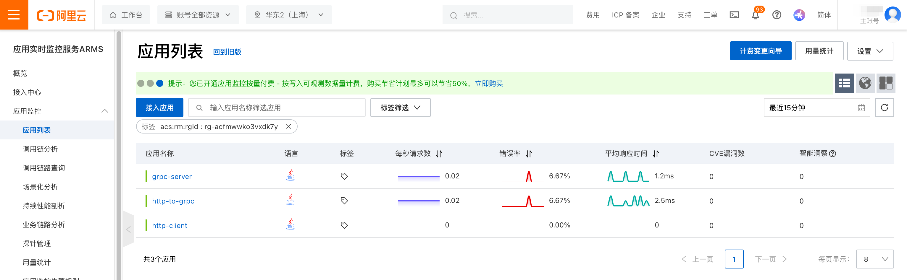

### 介绍
本项目包含三个微服务，用于快速构建简单的 java 应用。我主要用于快速构建应用，以在腾讯和阿里云可观测平台部署测试 demo 应用，体验其产品能力。


产物构建：
```shell
mvn clean package -DskipTests
```

镜像构建：
```shell
sh build.sh
```
生成三个镜像，分别：
- http-client:lastest
- http-to-grpc:lastest
- grpc-server:lastest

### 调用关系
```mermaid
graph LR
  subgraph 客户端
    A[http-client
    'cron']
  end

  subgraph 网关层
    B[http-to-grpc]
  end

  subgraph 服务层
    C[grpc-server]
  end

  subgraph 存储层
    D[MySQL]
  end

  A -- "http" --> B
  B -- "grpc" --> C
  C --> D
